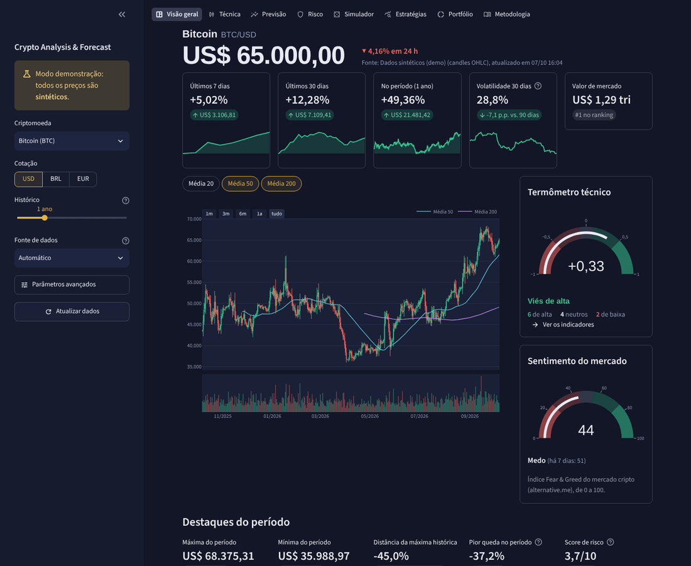
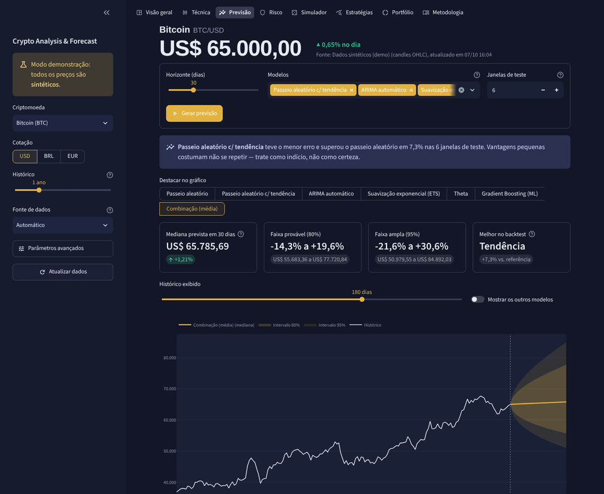
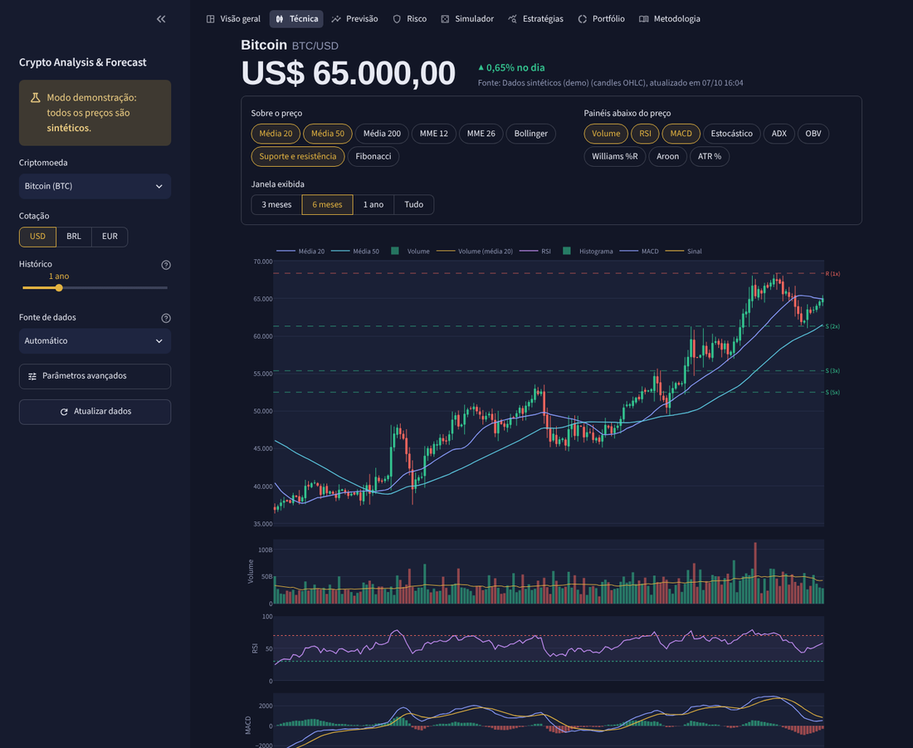
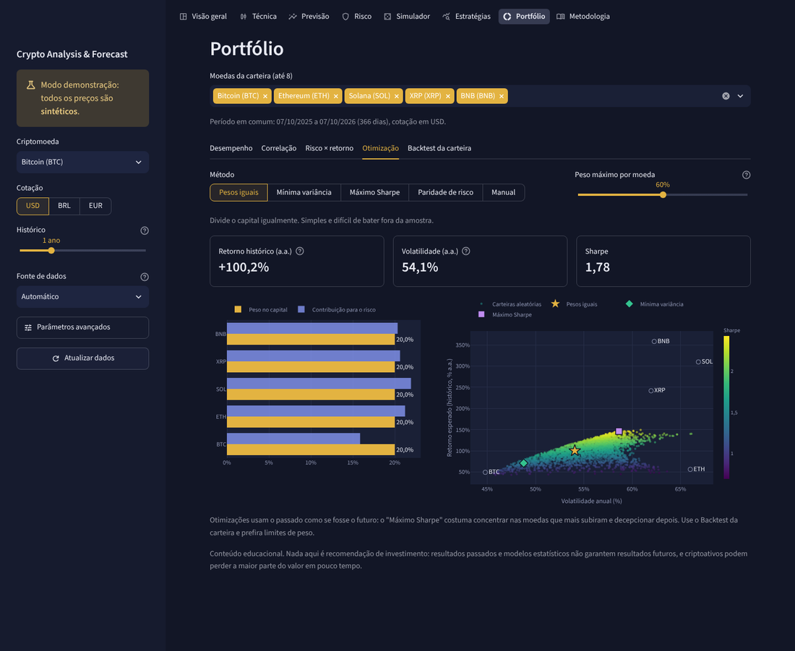
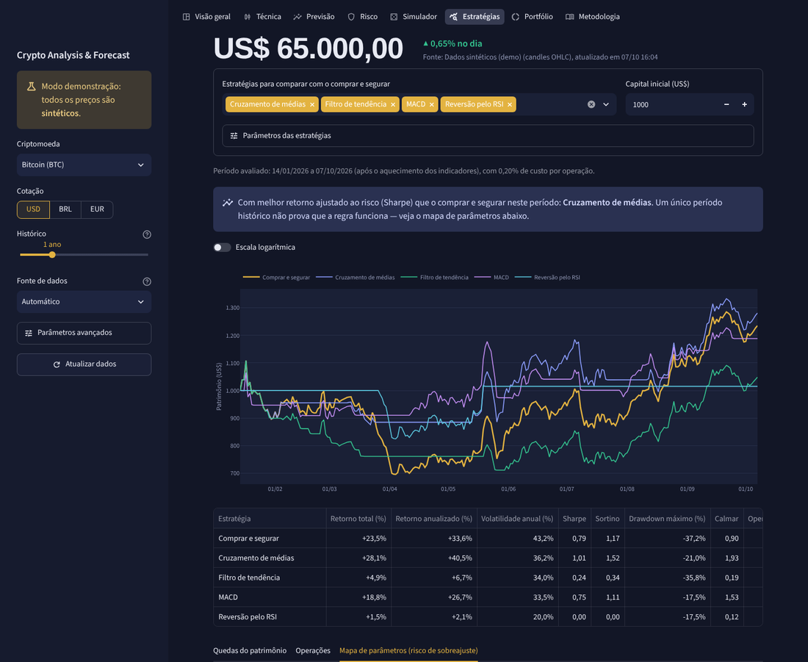

# Crypto Analysis & Forecast Platform

Plataforma em Streamlit para estudar criptomoedas: análise técnica, risco, previsões **validadas contra o passeio aleatório**, simulações de investimento, backtest de estratégias e montagem de carteiras.

> ⚠️ Projeto educacional. Nada aqui é recomendação de investimento.

Veja rodando: https://crypto-plataform.streamlit.app/



## O que a plataforma faz

| Página | Para que serve |
|---|---|
| **Visão geral** | Preço atual, variações de 7/30 dias e do período, volatilidade, valor de mercado, gráfico de candles com médias, termômetro técnico, índice Fear & Greed e destaques de risco. |
| **Técnica** | Gráfico configurável (médias, Bollinger, suportes/resistências, Fibonacci) com painéis de Volume, RSI, MACD, Estocástico, ADX, OBV, Williams %R, Aroon e ATR. Resumo técnico com 12 regras e histórico do score. |
| **Previsão** | Seis modelos (passeio aleatório, com tendência, ARIMA automático, ETS, Theta e Gradient Boosting) + combinação, com intervalos de 80% e 95%. Cada modelo é testado no passado (*walk-forward*) e comparado ao passeio aleatório. |
| **Risco** | Score de risco explicável (0–10), volatilidade (janelas e EWMA), VaR/CVaR (histórico, normal e Cornish-Fisher), drawdown, Sharpe, Sortino, Calmar, caudas, beta/correlação com o BTC e calculadora de tamanho de posição. |
| **Simulador** | Monte Carlo por reamostragem de blocos de retornos reais, "e se eu tivesse investido?" (aporte único vs. DCA com preços reais) e cenários a partir da previsão. |
| **Estratégias** | Backtest sem olhar para o futuro de 6 regras técnicas vs. comprar e segurar, com custos, lista de operações e mapa de parâmetros para expor sobreajuste. |
| **Portfólio** | Desempenho comparado, correlação, risco × retorno, otimização (pesos iguais, mínima variância, máximo Sharpe, paridade de risco ou manual) e backtest com rebalanceamento. |
| **Metodologia** | Fontes, métodos e limitações. |

Opções globais na barra lateral: 15 moedas (ou qualquer ID da CoinGecko), cotação em **USD, BRL ou EUR**, histórico de 6 meses a 5 anos, fonte de dados e parâmetros avançados (taxa livre de risco, taxas e slippage).

<table>
<tr>
<td></td>
<td></td>
</tr>
<tr>
<td></td>
<td></td>
</tr>
</table>

<sub>Capturas feitas em modo demonstração (preços sintéticos).</sub>

## Como executar

```bash
python -m venv .venv && source .venv/bin/activate   # Windows: .venv\Scripts\activate
pip install -r requirements.txt
streamlit run main.py
```

Abra http://localhost:8501.

### Chave da CoinGecko (opcional, recomendada)

Sem chave a API pública tem limite baixo de requisições — principalmente em servidores compartilhados como o Streamlit Community Cloud. Crie uma chave **Demo** gratuita em https://www.coingecko.com/pt/api e:

- **local:** copie `.streamlit/secrets.toml.example` para `.streamlit/secrets.toml` e preencha `COINGECKO_DEMO_API_KEY`, ou defina a variável de ambiente de mesmo nome;
- **Streamlit Cloud:** cole `COINGECKO_DEMO_API_KEY = "sua-chave"` em *Settings → Secrets*.

Mesmo sem chave o app funciona: se a CoinGecko falhar, ele tenta o Yahoo Finance e, em último caso, usa o último dado salvo (avisando que está desatualizado).

### Modo demonstração

Para explorar ou desenvolver sem internet, rode com dados sintéticos (o app avisa na tela que os preços não são reais):

```bash
CRYPTO_PLATFORM_DEMO=1 streamlit run main.py
```

### Testes

```bash
pip install -r requirements-dev.txt
pytest          # 102 testes: dados, indicadores, previsão, risco, simulação, backtest, portfólio e interface
ruff check .
```

Os testes não acessam a internet (respostas das APIs são simuladas). O GitHub Actions roda tudo em Python 3.11, 3.12 e 3.13.

## Fontes de dados

| Fonte | Dados | Observações |
|---|---|---|
| CoinGecko | Fechamento diário, volume, valor de mercado, ranking, máxima histórica | Gratuita limitada a 365 dias |
| Yahoo Finance | Candles diários OHLCV | Histórico longo; BRL/EUR convertidos pelo câmbio diário |
| alternative.me | Índice Fear & Greed | — |

Em modo **Automático** a CoinGecko é a primeira opção; para históricos acima de 1 ano o Yahoo Finance é usado primeiro. Dados ficam em cache por 1 hora (memória + disco).

## Arquitetura

```
crypto-platform/
├── main.py                        # ponto de entrada do Streamlit
├── crypto_platform/
│   ├── config.py                  # catálogo de moedas, moedas de cotação, parâmetros
│   ├── formatting.py              # números no padrão brasileiro
│   ├── data_collector.py          # CoinGecko / Yahoo / sintético, cache, retry, fallback
│   ├── technical_indicators.py    # indicadores, resumo técnico, suportes/resistências
│   ├── forecast_model.py          # modelos de previsão + validação walk-forward
│   ├── risk_analyzer.py           # volatilidade, VaR/CVaR, drawdown, score de risco
│   ├── investment_simulator.py    # Monte Carlo, aporte único vs. DCA, cenários
│   ├── backtesting.py             # backtest de estratégias técnicas
│   ├── portfolio.py               # correlação, otimização, backtest de carteira
│   └── ui/                        # interface: app, tema, gráficos, componentes e páginas
├── tests/                         # pytest (unitários + interface com AppTest)
├── .streamlit/config.toml         # tema visual
└── docs/                          # capturas de tela
```

A lógica de cálculo não depende do Streamlit — pode ser usada em notebooks ou scripts:

```python
from crypto_platform.config import COINS
from crypto_platform.data_collector import CryptoDataCollector
from crypto_platform.forecast_model import run_forecast

md = CryptoDataCollector().get_market_data(COINS[0], days=365, currency="brl")
rep = run_forecast(md.close, horizon=30)
print(rep.metrics[["MAPE", "Skill"]])  # erro de cada modelo vs. passeio aleatório
```

## Metodologia (resumo)

- **Indicadores:** RSI, ATR e ADX com suavização de Wilder (mesma convenção do TradingView/TA-Lib).
- **Previsão:** modelos no log do preço; valor central = mediana; intervalos de 80% e 95%. Validação com origem móvel: cada previsão de teste usa apenas dados anteriores à data. Um modelo só "vale" se tiver erro menor que o passeio aleatório.
- **Risco:** anualização com 365 dias; Sortino com desvio de perdas correto; VaR histórico, normal e Cornish-Fisher.
- **Backtests:** sinal do dia *t* só afeta a posição a partir de *t+1*; taxa + slippage em cada troca.
- **Carteira:** covariância encolhida (Ledoit-Wolf) e limite de peso por ativo.

Detalhes na página **Metodologia** do app.

## Limitações

- Modelos supõem que o futuro se parece com o passado; mudanças de regime são frequentes em cripto.
- Backtests e otimizações avaliam o mesmo período em que foram ajustados e tendem a parecer melhores do que seriam na prática.
- Impostos não são considerados.

## Deploy no Streamlit Community Cloud

Arquivo principal: `main.py`. As dependências são instaladas a partir de `requirements.txt`; configure a chave da CoinGecko em *Secrets* (veja acima).

## Contribuições

1. Faça um fork e crie uma branch.
2. Escreva testes para a nova funcionalidade (`pytest`).
3. Rode `ruff check .` e abra o pull request.

---

**Aviso:** este projeto é apenas para fins educacionais e de pesquisa. Criptoativos são altamente voláteis; faça sua própria pesquisa.
